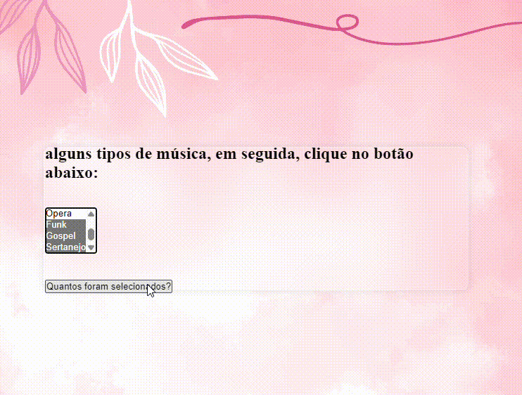

# Introdução
A proposta dessa tividade foi pegar um códido [Mdn Web Docs](https://developer.mozilla.org/pt-BR/docs/Web/JavaScript/Guide/Loops_and_iteration)

✨ Um laço for é repetido até que a condição especificada seja falsa. O laço for no JavaScript é similar ao Java e C. Uma declaração for é feita da seguinte maneira.
1 A expressão expressao Inicial é inicializada e, caso possível, é executada. Normalmente essa expressão inicializa um ou mais contadores, mas a sintaxe permite expressões de qualquer grau de complexidade. Podendo conter também declaração de variáveis.
2 A expressão condicao é avaliada. caso o resultado de condicao seja verdadeiro, o laço é executado. Se o valor de condicao é falso, então o laço terminará. Se a expressão condicao é omitida, a condicao é assumida como verdadeira.
3 A instrução é executada. Para executar múltiplas declarações, use uma declaração em bloco ({ ... }) para agrupá-las.
4 A atualização da expressão incremento, se houver, executa, e retorna o controle para o passo 2.
 A função a seguir contém uma declaração for que contará o número de opções selecionadas em uma lista (um elemento <select> permite várias seleções). Dentro do for é declarado uma váriavel i inicializada com zero. A declaração for verifica se i é menor que o número de opções no elemento <select>, executa sucessivas declaração if, e incrementa i de um em um a cada passagem pelo laço.

# Interface
Foto de como está o site:

Nesse video, quando adicionamos algumas músicas, vemos que em seguida a caixinha de alert aparece informando quantas músicas foram  selecionadas.

# Ferramentas ultilizadas
* HTML5 
* CSS
* GitRub  
* [Mdn Web Docs](https://developer.mozilla.org/pt-BR/docs/Web/JavaScript/Guide/Loops_and_iteration)
* [Freepik](https://br.freepik.com/)

# Explicação do código
Aqui o prefessor queria que a gente pegasse um código que não sabiamos:

## Return
A declaração *return* finaliza a execução de uma função e especifica os valores que devem ser retonados para onde a função foi chamada.

# Sintase
return [[expression]];

# Descrição
Quando uma declaração return é usada em um corpo de função, a execução dessa função é parada. Se especificado, um dado valor é retornado à quem chamou a função. Se a expressão for omitida, undefined será retornado. Todas as declarações return a seguir param a execução da função:
